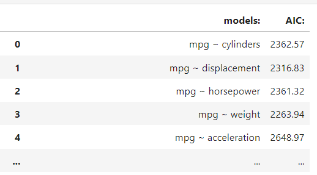

---
jupyter:
  jupytext:
    formats: ipynb,Rmd
    text_representation:
      extension: .Rmd
      format_name: rmarkdown
      format_version: '1.2'
      jupytext_version: 1.15.2
  kernelspec:
    display_name: Python 3 (ipykernel)
    language: python
    name: python3
---

# Polynomial regression model building exercise

We're going to build a variety of models in this exercise, in order to explore model-building techniques from both a Culture One and Culture Two perspective. This exercise is very open-ended - there are many different ways to implement the tasks. You can use the methods in the textbook pages, and you can search stackoverflow to find new techniques which might be helpful. 

Aside from where you are specifically directed to use a certain method, there is no one correct way of approaching these tasks, so please use the methods that make most sense to you. And please write the code yourself, don't use an AI friend...you can ask an AI to suggest methods you might use, but in your prompt please instruct it **not** to write any code for you. We strongly encourage you to try to think about each problem, and to use stackoverflow first, before using AI (if at all). 

Here's what we're going to do:

- we're going to use a classical model building technique to find a ranking of the "best" models (e.g. the most parsimonious models, with respect to goodness-of-fit vs complexity)
- we're then going to use cross-validation to see how these "best" models perform, and whether cross-validation implies a different "best" model to the classical method
- we'll then evaluate different models performance on a "test set", e.g. data not used at all in the earlier fitting process. This will allow us to see whether the Culture One or Culture Two method correctly leads us to the model which performs best on the unseen test set...

We'll be using a version of the [Auto MPG](https://archive.ics.uci.edu/dataset/9/auto+mpg) dataset, involving the following variables:

`mpg` - miles per galon of fuel (continuous variable)

`cylinders` - number of engine cylinders (multi-valued discrete variable).

`displacement` - [volume of air displaced by the engine] (continuous variable)

`horsepower` - the power produced by engine to move the car (continuous variable)

`weight` - car weight (continuous variable)

`acceleration` - the acceleration an engine can get per second (continuous variable)

`name` - car model name (unique for each instance)

The dataset (and some libraries we think you'll find useful) are imported below:pulation data

```{python}
# DO NOT CHANGE THIS CODE, JUST RUN IT
import pandas as pd
import numpy as np
import matplotlib.pyplot as plt
import statsmodels.formula.api as smf
import seaborn as sns
import itertools

# import the data
df = pd.read_csv('data/Auto.csv')[['mpg', 'cylinders', 'displacement', 'horsepower', 'weight', 'acceleration', 'name']]

# a random sample of rows (previously generated)
test_rows = [347,  25, 181, 294, 367, 390, 220, 386,  36, 370, 214, 300, 222,
        11, 133,  38,   4, 338, 310, 148, 291, 344, 379, 315, 104,  55,
       161,  48, 375, 153, 279, 299, 380, 262, 276, 293, 145, 353, 201,
        10, 233,  43, 260, 318, 251, 301, 123, 177,  31,  62, 266, 237,
        52, 361, 271,  33, 202, 221, 131, 178, 193, 249,  26, 147,  20,
       292, 381, 303,  42, 373, 330, 333, 332, 146, 346, 176, 274,  78,
       268, 340, 179,  87,  51, 172,  27, 362, 184, 354,  91, 231]

# test/train split (we'll use this later)
df_test = df.loc[test_rows]
df = df.loc[~pd.Series(df.index).isin(test_rows)]

# show the dataframe
df
```

### Task 1 - Graphical Inspection

We'll be using `mpg` as our target/outcome variable. To begin, we'll graphically inspect the relationship between each predictor and the target variable.

So, for every variable that isn't `name` or `mpg`, we want to plot it's relationship with `mpg`. You can use any plotting method you like.

*Hint*: the `seaborn` library (which has been imported as `sns`) has a function which may be useful here, as it will let you do this process in one step, see [here](https://seaborn.pydata.org/tutorial/axis_grids.html#plotting-pairwise-data-relationships). You don't have to use this method though, any plotting method is fine.

The cell immediately below creates a variable called `outcome` containing the name of outcome/target variable, and another variable called `predictors`, containing the names of the predictor variables:

```{python}
# the outcome/target variable
outcome = 'mpg'

# an array containing strings of the predictor variables
predictors = df.columns[(df.columns != outcome) & (df.columns != 'name')].values

print(f"outcome = {outcome}")
print(f"predictors = {predictors}")
```

```{python}
# generate scatterplots of `mpg` as a function of 
...
```

## Task 2

We have five predictor variables, that may not seem like many, but there are actually a large number of models we could fit to this dataset, as we add/remove different predictors (especially as we start to include polynomial terms). We want to find the "best" (most parsimonous) model, out of all the models we could possibly fit.

The cell below contains some code you can adapt to generate model strings like `mpg ~ horsepower + weight`, for use with `statsmodels.formula`. You should adapt this code so that you can generate many (or all) of the possible model specifications we might fit to this data. So, you should generate a set of strings like:

`mpg ~ horsepower`

`mpg ~ horsepower + weight`

`mpg ~ horsepower + weight + acceleration`

etc. etc.

Because there looks to be some nonlinear relationships between some of the predictors and the outcome, you may also want to find a way to include polynomial terms for the relevant variables...

Once we have the strings for the model specifications, you should loop over them and use `statsmodels.formula` to fit a model for each specification. (`statsmodels.formula` was imported earlier as `smf`).

Specifically, you should use `smf.ols()` to fit each model - remember, if the model specification includes a polynomial term, `smf.ols()` will fit a polynomial regression model.

Your task is to find the most parsiomonious model, as measured by the Akaike Information Criterion (AIC). You end goal is to generate a dataframe like this (call it `results_df`), with the model specifications in one column, and the AIC in another:



You can then sort the dataframe by AIC to find the most parsimonious model (according to the AIC)...

*Remember*: after you've fit a model in stats models you can use the `.aic` attribute to show its AIC. Remember that **lower AIC is better** e.g. represents a better balance of goodness-of-fit and complexity.

*Note*: **this task is hard**, but it's very useful to know how to do this for testing a large variety of models...

```{python}
# adapting this code will help you generate your model specification strings

# a counter variable, to show how many times the loop has iterated
count = 0

# loop over the number of predictors (we go from 1 to len(predictors)+1 here to include all models
# adjust the code and look at the printout to see why this is necessary
for i in np.arange(1, len(predictors) + 1):

    # this code is obscure, and annoyingly returns tuples, but its a very common way
    # of generating combinations of strings
    for combination in itertools.combinations(predictors, i):
        print(i, count, combination)
        count += 1
```

```{python}
# your code here...
...
results_df = ...
```

```{python}
# sort your results_df dataframe by AIC and get the "best" model
...
```

## Task 3

From your dataframe,`results_df`, containing the model specifications and their associated AIC values, get the model specifications of the 5 "best" models (e.g. those with the lowest AIC).

You should now use `sklearn` to employ k-fold cross-validation with these 5 best models, use any relevant scoring metric (negative RMSE is a good place to start...)

You may not want polynomial terms for every predictor. The easiest way to include polynomial terms for a subset of the predictors is to add columns to your dataframe containing the values from the relevant predictors, raised to a power, as in the cell below:

```{python}
# some extra imports that will help here
from sklearn.model_selection import cross_val_score
from sklearn.linear_model import LinearRegression
from sklearn.preprocessing import PolynomialFeatures
from sklearn.pipeline import make_pipeline

# make a copied dataframe
df_for_crossval = df.copy()

# add polynomial terms for specific predictors
df_for_crossval['displacement**2'] = df['displacement']**2
df_for_crossval['horsepower**2'] = df['horsepower']**2
df_for_crossval['weight**2'] = df['weight']**2

# show the dataframe
df_for_crossval
```

You can then retrieve specific columns from your dataframe corresponding to the features/predictors in the 5 best models, and perform cross-validation with a model just fit to those features.

**What we are looking here is whether cross-validation performance is consistent with the ranking that we did using the AIC**.

```{python}
# an example crossvalidation with a "no polynomial" model
# replace this with your code, doing separate cross validations
# for the 5 "best" models obtained via AIC comparison
no_polynomials = ['cylinders', 'displacement', 'horsepower', 'weight', 'acceleration']

-np.mean(cross_val_score(LinearRegression(), X=df_for_crossval[no_polynomials],
                                           y=df_for_crossval[outcome],
                                           cv=5, scoring='neg_mean_squared_error'))
```

# Final comparisons to test/data

- now use the function below to evaluate the 5 best models performance on the unseen test data (stored in `df_test`).

You will need to add columns to `df_test` containing any polynomial features you want to use.

```{python}
def MSE(y, y_hat):
    """
    A function to calculate the mean squared error between
    a target vector and some predictions,
    """

    errors = (y - y_hat)**2

    return np.mean(errors)
```

```{python}
# your code here 
...
```
